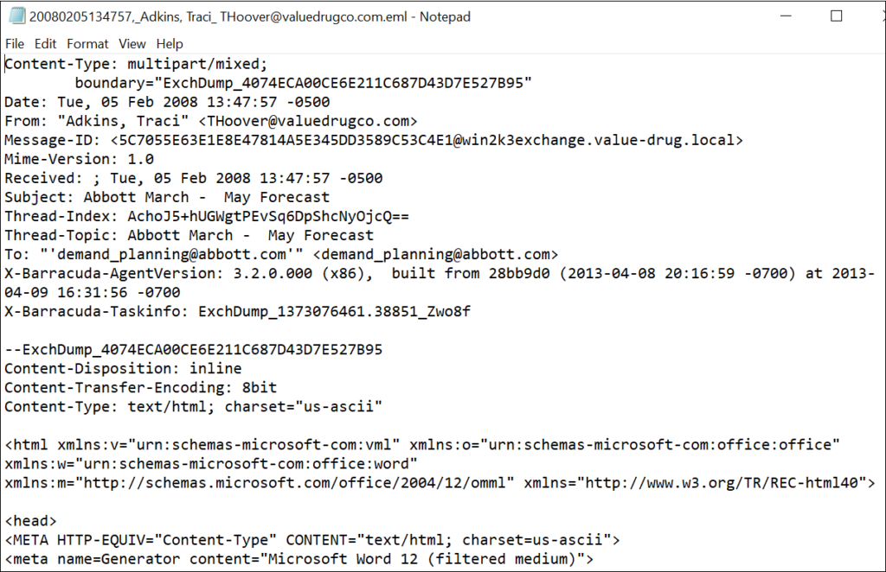

Electronic Mail

# Explications globales 

Il s'agit d'un format de fichier email sauvegardé par la boîte mail que l'on utilise (ex: Outlook, Apple Mail etc...). Ce fichier contient le contenu du message, le sujet, la date, l'expéditeur et le(s) destinataire(s). On peut donc sauvegarder un email reçu sur notre ordinateur afin de le relire via notre propre éditeur de texte favoris (bloc-notes par exemple), mais cela peut paraître compliqué à lire car nous aurons le contenu brut de l'eamil.

Cependant, ce même fichier peut être lu dans une application client mail, ou même notre navigateur préféré, en glissant notre fichier sur un nouvel onglet que l'on soit connecté ou non à internet. Ce dernier se chargera de retenir uniquement le contenu de l'email.

# Informations supplémentaires

Ce format de fichier a été développé par Microsoft dans le but de standardiser le transfert d'emails entre différentes boîtes mail. Elle fait suite au [document RFC - 5322](https://datatracker.ietf.org/doc/html/rfc5322).

## RFC :
>Les RFC (Request For Comments) sont un ensemble de documents qui font >référence auprès de la Communauté Internet et qui décrivent, spécifient, >aident à l'implémentation, standardisent et débattent de la majorité des >normes, standards, technologies et protocoles liés à Internet et aux >réseaux en général.

## Sécurité
Ce fichier conserve le format HTML d'origine de l'email ainsi que les headers.
On peut donc utiliser ce format de fichier afin d'analyser les emails frauduleux et décoder le contenu des pièces jointes frauduleuses. 
